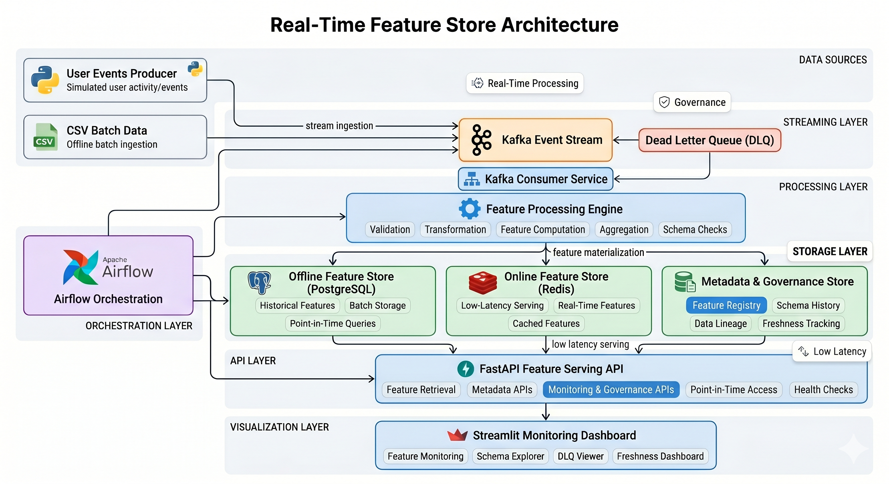
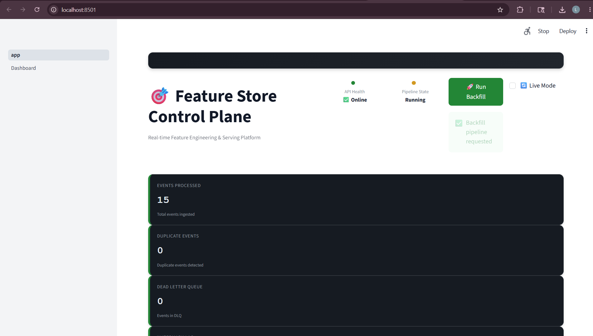
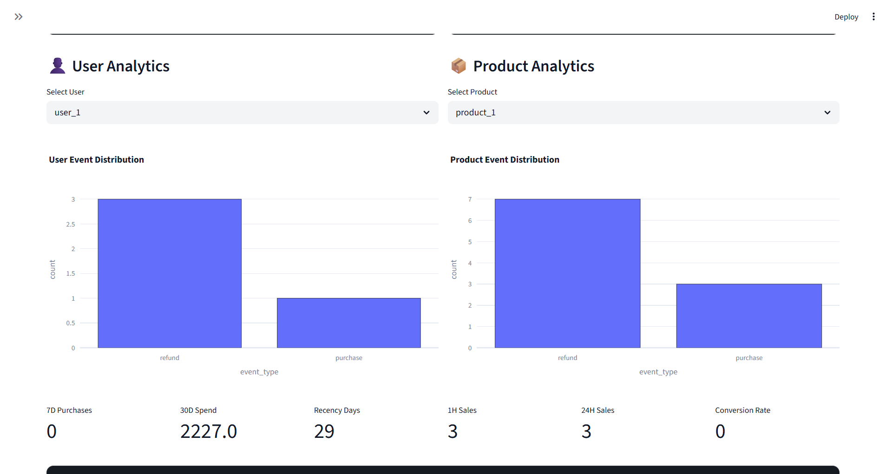
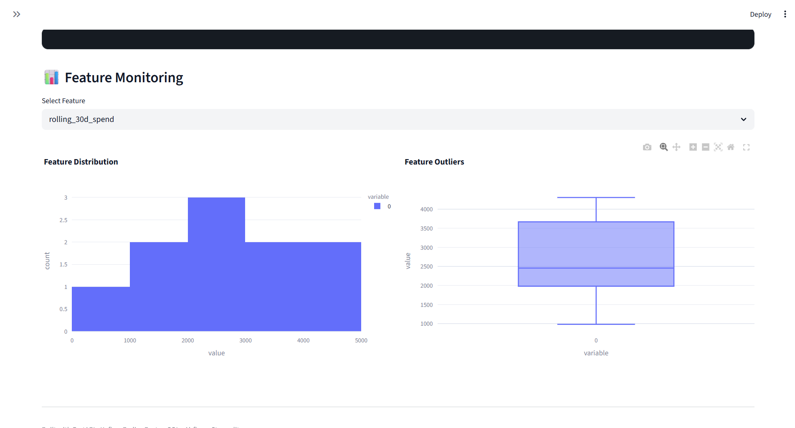
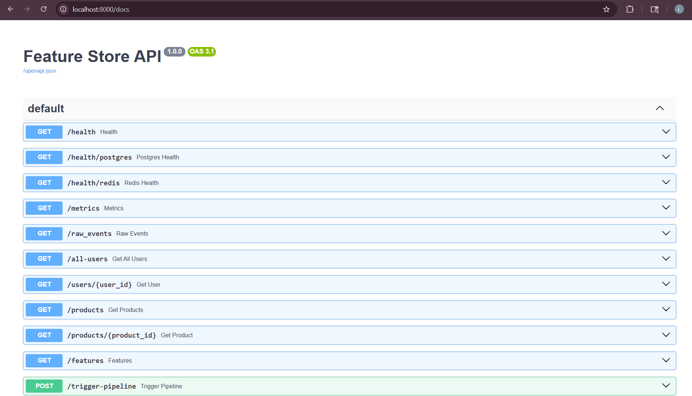

# Real-Time Feature Store and Data Platform

A production-inspired real-time feature store platform built using Kafka, FastAPI, PostgreSQL, Redis, Airflow, and Streamlit.

This project demonstrates modern Data Engineering, Backend Engineering, and MLOps concepts including streaming ingestion, online/offline feature serving, metadata governance, point-in-time querying, schema evolution tracking, and low-latency feature access.

---

# Overview

Modern ML systems require reliable feature infrastructure to ensure consistency between training and inference pipelines.

This project implements a simplified but realistic feature store architecture that supports:

* Real-time feature ingestion
* Streaming event processing
* Online and offline feature stores
* Feature metadata governance
* Point-in-time feature retrieval
* Dead Letter Queue (DLQ) handling
* Workflow orchestration
* Monitoring dashboards

The system is designed to resemble production-style ML infrastructure and backend data platforms.

---

# Architecture



---

# Dashboard

## Control Plane



---

## User & Product Analytics



---

## Feature Monitoring



## Swagger UI



# Key Features

## Streaming Ingestion

* Kafka-based event streaming
* Real-time user event ingestion
* Kafka consumer processing pipeline
* DLQ support for invalid or failed events

## Feature Processing

* Event validation
* Feature transformation
* Aggregation pipelines
* Schema validation
* Feature computation workflows

## Online & Offline Feature Stores

### PostgreSQL (Offline Store)

* Historical feature storage
* Batch retrieval
* Point-in-time feature queries
* Persistent analytics storage

### Redis (Online Store)

* Low-latency feature serving
* Real-time feature access
* Cached feature retrieval

## Metadata & Governance

* Feature registry
* Schema history tracking
* Data lineage tracking
* Feature freshness monitoring
* Governance APIs

## API Layer

Built using FastAPI.

Provides:

* Feature retrieval APIs
* Metadata APIs
* Point-in-time access APIs
* Monitoring and governance APIs
* Health check endpoints

## Workflow Orchestration

* Apache Airflow DAG orchestration
* Scheduled feature workflows
* Pipeline management

## Monitoring Dashboard

Built using Streamlit.

Includes:

* Feature monitoring
* Schema explorer
* DLQ inspection
* Freshness dashboard

---

# Tech Stack

| Category         | Technologies   |
| ---------------- | -------------- |
| Streaming        | Apache Kafka   |
| Backend API      | FastAPI        |
| Offline Store    | PostgreSQL     |
| Online Store     | Redis          |
| Orchestration    | Apache Airflow |
| Dashboard        | Streamlit      |
| Language         | Python         |
| Containerization | Docker         |

---

# Project Structure

```text
feature-store/
│
├── api/                        # FastAPI backend services
├── ingestion/                 # Event ingestion logic
├── processing/                # Feature transformation and validation
├── storage/                   # PostgreSQL and Redis integrations
├── stream_processing/         # Kafka consumers and streaming logic
├── airflow_orchestration/     # Airflow DAGs and workflows
├── ui/                        # Streamlit dashboard
├── docker/                    # Docker configuration files
├── tests/                     # Test suites
├── docs/                      # Architecture diagrams and documentation
├── requirements.txt
├── docker-compose.yml
└── README.md
```

---

# System Workflow

## Event Flow

1. User events are generated from producers or batch CSV sources.
2. Events are pushed into Kafka topics.
3. Kafka consumers process streaming events.
4. Feature processing engine validates and transforms incoming data.
5. Processed features are written into:

   * PostgreSQL (offline store)
   * Redis (online store)
   * Metadata governance store
6. FastAPI exposes feature-serving and governance APIs.
7. Streamlit dashboard visualizes system monitoring and metadata.

---

# APIs

## Feature APIs

```http
GET /features/{user_id}
```

Retrieve real-time features for a user.

---

```http
GET /features/{user_id}/at?ts=<timestamp>
```

Retrieve historical point-in-time features.

---

## Metadata APIs

```http
GET /metadata/features
```

Retrieve feature registry metadata.

---

```http
GET /metadata/lineage
```

Retrieve feature lineage information.

---

```http
GET /schema/history
```

Retrieve schema evolution history.

---

## Health APIs

```http
GET /health
```

Basic application health check.

---

```http
GET /health/postgres
```

PostgreSQL connectivity check.

---

```http
GET /health/redis
```

Redis connectivity check.

---

# Getting Started

## Prerequisites

Make sure the following are installed:

* Python 3.10+
* Docker
* Docker Compose

---

# Installation

## Clone Repository

```bash
git clone https://github.com/Laksha-python/feature-store.git
cd feature-store
```

---

## Setup Environment

```bash
python -m venv venv
```

### Windows

```bash
venv\Scripts\activate
```

### Linux / MacOS

```bash
source venv/bin/activate
```

---

## Install Dependencies

```bash
pip install -r requirements.txt
```

---

# Running the Platform

## Start Services

```bash
docker-compose up --build
```

This starts:

* Kafka
* Zookeeper
* PostgreSQL
* Redis
* FastAPI
* Streamlit
* Airflow

---

# Streamlit Dashboard

Open:

```text
http://localhost:8501
```

---

# FastAPI Swagger Docs

Open:

```text
http://localhost:8000/docs
```

---

# Future Improvements

Potential future enhancements:

* Feature versioning
* TTL-based Redis freshness
* Prometheus/Grafana monitoring
* Kubernetes deployment
* CI/CD pipelines
* Streaming aggregations
* Authentication and RBAC
* Advanced observability

---

# Engineering Concepts Demonstrated

This project demonstrates:

* Event-driven architecture
* Real-time streaming systems
* ETL pipelines
* Online/offline feature stores
* Metadata governance
* Data lineage tracking
* Low-latency serving
* Distributed system concepts
* Workflow orchestration
* Backend API development

---

# Use Cases

This architecture can support:

* Recommendation systems
* Fraud detection pipelines
* Real-time analytics
* Personalization systems
* Feature engineering platforms
* ML training and inference systems

---

# Author

Laksha K

